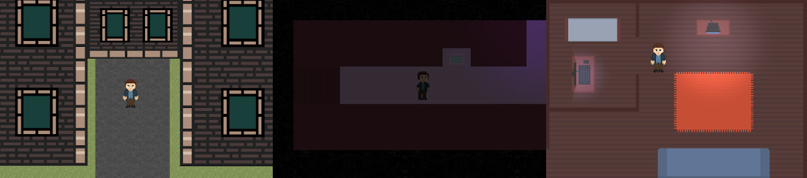

# Student Quest

A pixel art game created on the [Godot engine](https://godotengine.org/).
We open the source code of the game so that anyone can help us with the development. It is possible you will come across a lot of bad code and even more bad sprites.
## How to open a project in editor:
0. Download this repository as a zip file and extract it or `git clone git@github.com:studentquest/game.git` 
1. Download [Godot Engine](https://godotengine.org/). It's is free and takes about 30 mb in the archive
2. Click `import` in editor and find `project.godot`
## How to play without too much effort:
Use the links below or visit our [website](https://studentquest.github.io) and download latest version for your platform. This is not necessarily a version with all the latest changes, but we try to keep them updated. We plan to create a page on itch.io, but so far the game is only at the beginning of development.
## Branches:
There are two branches right now: `master` and `dev`. It is obvious that all the latest changes are made to the `dev` branch, and then, when it comes time to release a new version, the game is checked and the code is transferred to the `master` branch. On its basis, official versions of the game are created.
## API used in the game
Check out the wiki, there should be enough material. And if there is no necessary information, then write to us in any way.
## Contacts and links:
* Official website: [Student Quest](https://studentquest.github.io)
* Telegram channel: [Student Quest](https://t.me/studentquest)
* Godot Engine: [Official Site](https://godotengine.org/)
* Latest Android release: [Google Drive](https://drive.google.com/open?id=1Mp3_Vh-sVqQKKeLs42w9yiUnBdj43oBX)
* Latest Windows release: [Google Drive](https://drive.google.com/open?id=1v9jKzDJctLt5W8b9aDoHxbaSTKmoRQe7)
* Latest Linux release: [Google Drive](https://drive.google.com/open?id=1Tjl0SsbWeaiJJelYQJj9KmPOpErjfet5)
* Latest Mac OS release: [Google Drive](https://drive.google.com/open?id=1R2lqwOMNBCSfitSlUxiagyOvqOX98lLU) (We have no way to check whether it works or not)
* My mail: [mcraw@protonmail.com](mailto:mcraw@protonmail.com)